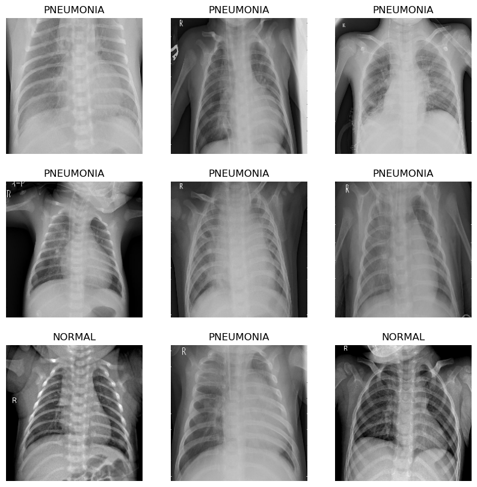
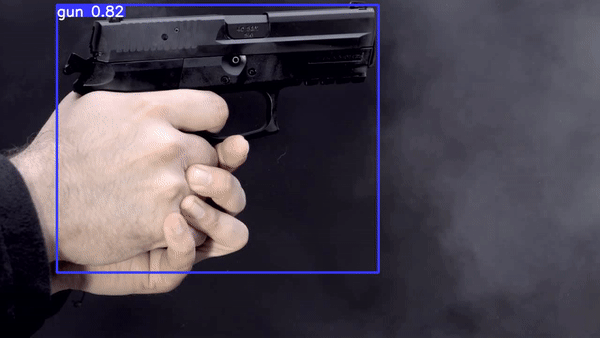

# Johann Pineda    [theoneonlyjohann@gmail.com](theoneonlyjohann@gmail.com)

Hello, I'm Johann, a U.S.-based professional specializing in Data and Information Technology. I have a strong foundation in computer science and extensive experience in data management and IT systems. 

## 📃Certfications
<table>
  <tr>
    <td></td>
    <td></td>
  </tr>
  <tr>
    <td></td>
    <td></td>
  </tr>
  <tr>
    <td></td>
    <td></td>
  </tr>
</table>

## 💻Projects
* [Uber-Clone](https://github.com/theonejohann/Uber-Clone)
* [Bilibili-Netflix Clone] (https://github.com/theonejohann/bilibili-netflix)
* [🔬🔍Melanoma Cancer Image Classification](https://www.kaggle.com/code/theoneandonlyp/melanoma-cancer-image-classification)
* [🧠Brain tumors Classification](https://www.kaggle.com/code/theoneandonlyp/brain-tumors-classification/notebook)
* [Blog-Generation-with-Artificial-Intelligence](https://github.com/theonejohann/Blog-Generation-with-Artificial-Intelligence)
* [Chest XRay Images (Pneumonia) Image Classification](https://www.kaggle.com/code/theoneandonlyp/chest-xray-images-pneumonia-image-classification/comments)
* [88% (R2) Medical Insurance Cost Prediction (kaggle.com)](https://www.kaggle.com/code/theoneandonlyp/88-r2-medical-insurance-cost-prediction)
* [90.82% Osteoporosis Risk Prediction  (kaggle.com)](https://www.kaggle.com/code/theoneandonlyp/90-82-osteoporosis-risk-prediction/notebook)
* [86.22% Heart Disease Prediction  (kaggle.com)](https://www.kaggle.com/code/theoneandonlyp/86-22-heart-disease-prediction?scriptVersionId=168005103)

## 👩‍💻Examples of my Work

<table>
  <tr>
    <td></td>
    <td></td>
  </tr>
  <tr>
    <td></td>
    <td></td>
  </tr>
</table>

